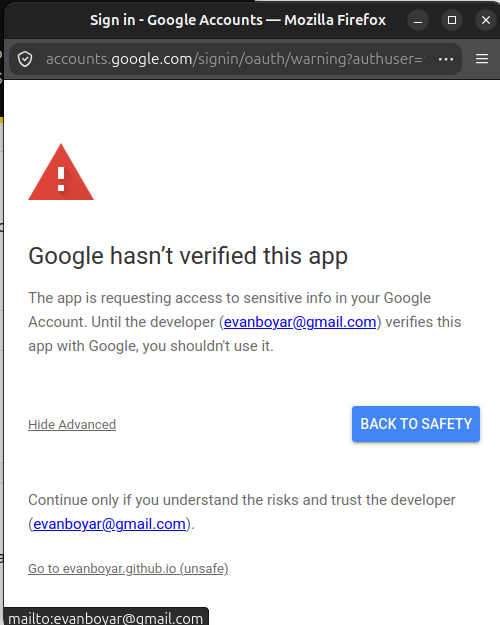
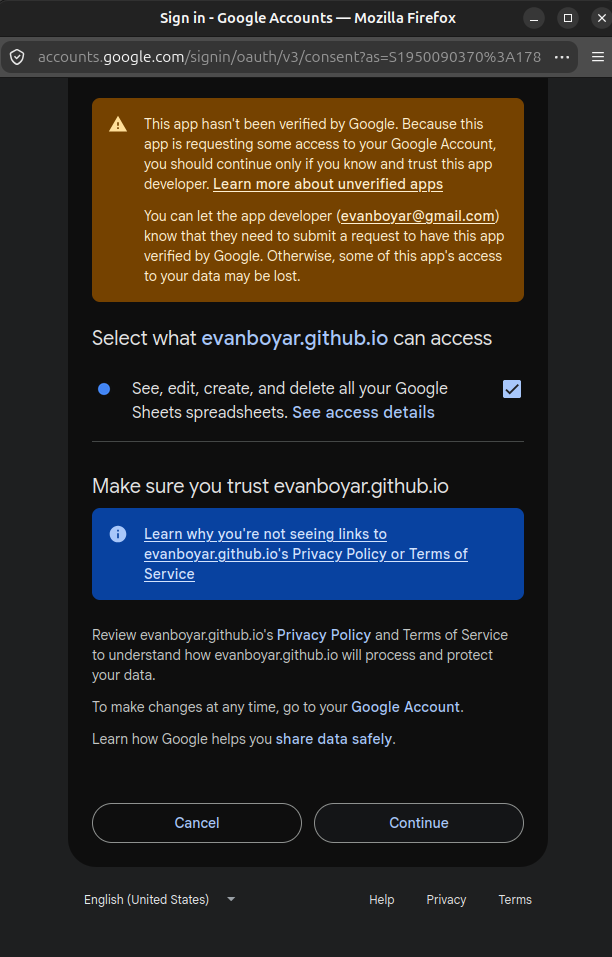

# Fellowship Attendance

A small web page that turns a Zoom participant report into attendance records for the Fellowship program. Staff upload the CSV that Zoom produces, check the results on screen, and save them as a new tab in the roster Google Sheet.

Live page: https://evanboyar.github.io/NRI-attendees/

## How staff use it

You need three things: the Zoom report for the session, a Google account that can edit the roster Sheet, and a web browser. Nothing needs to be installed.

### 1. Get the report from Zoom

1. Sign in to Zoom on the web and open Reports.
2. Choose Usage, find the session meeting, and click the participant count.
3. Tick "Show unique users" if it is offered, then click Export. Zoom downloads a CSV file.

If Zoom offers "Export with meeting data", that works too. The page looks for the participant columns wherever they are.

### 2. Open the page, paste the Sheet link, and sign in

Open the live page. Paste the link to the roster Google Sheet into the box under step 1 (copy it from your browser's address bar while the Sheet is open). The page remembers the link on your computer, so you only do this once.

Then click "Sign in with Google" and pick the account that has access to that Sheet. The first time, Google asks you to allow the page to edit your spreadsheets. It only touches the Sheet you pasted.

#### The warning screens you will see the first time

Google shows two warning screens the first time you sign in from a given account. They look alarming, but they appear for any small app that has not gone through Google's paid verification review. It is safe to continue.

The first screen says "Google hasn't verified this app". Click **Advanced** (the link on the left), then click **Go to evanboyar.github.io (unsafe)**.



The second screen asks you to confirm what the page can access. Leave the "See, edit, create, and delete all your Google Sheets spreadsheets" box ticked (the page cannot save results without it) and click **Continue**.



You only see these once per Google account. Later sign-ins go straight through. The permission covers your spreadsheets in general because that is the only permission Google offers for writing to Sheets, but the page only ever opens the one whose link you pasted. You can remove the permission at any time at https://myaccount.google.com/permissions.

Once you are signed in, the page reads the roster and tells you how many people it found. If you want to switch to a different Sheet later, paste the new link and click "Load roster".

### 3. Upload the Zoom report

Click "Choose File" under step 2 and pick the CSV you downloaded. The page reads the session date from the report. The start time, end time, and the number of minutes a Fellow is allowed to miss are filled in with the program defaults (5:00 to 6:30 PM, 10 minutes). Change them if this session was different.

### 4. Check the results

The page shows a count of who was present, absent, and so on, then two tables.

The first table, "Zoom entries that need a look", lists everyone who could not be matched to the roster by email. For each one the page suggests who it thinks the person is, or says it could not tell. Check the suggestion. If it is wrong, pick the right person from the dropdown, choose "Someone else on the roster" to search the whole list, or choose "Not a Fellow" for guests, staff, and devices like "iPad (2)".

The second table lists every Fellow on the roster with their attendance, minutes in the session, and any notes. You can filter it to absent Fellows only, or to rows with notes.

### 5. Save to the Sheet

Click "Save to Google Sheet". The results go into a tab named "Attendance" plus the session date, for example "Attendance 2026-08-26". If that tab already exists, the page asks before replacing it. When it finishes it gives you a link to the new tab.

The roster tab is never changed.

## What the results mean

Each Fellow gets one of these:

- **Present**: they missed 10 minutes or less of the session (or whatever allowance you set).
- **Absent**: they missed more than the allowance, or they were not in the report at all.
- **Not enrolled**: the roster says they are Withdrawn or Removed. They are listed so nobody is lost, but they are not scored.

Minutes are counted only between the session start and end. Joining early or staying late does not add time. If someone dropped and rejoined, their separate stretches are added together.

Under the Fellows, the tab lists Zoom attendees who are not on the roster (guests, staff, unnamed devices, and anything you left as "Needs review"), followed by a short summary of the session and the file that was used.

## How matching works

The page matches each Zoom entry to the roster in this order:

1. **Email.** If the Zoom email matches a roster email (ignoring capitalization), that is the person.
2. **Name.** Otherwise the name is compared after cleaning: accents, emoji, pronoun tags like "(she/her)", device tags like "(iPhone)", titles like "Prof.", and word order are all ignored, and common short names are expanded (Mike for Michael, Katie for Katherine, and so on). One clear roster match is accepted, with a note explaining it.
3. **Spelling.** A name that is one or two letters off from exactly one roster name is accepted with a note.
4. **Review.** Anything else with a plausible candidate, or with more than one candidate, is held for you to decide. Entries with nothing close, such as "Pixel 9", are listed as not on the roster.

Anything not matched by email appears in the review table so a person can confirm it before saving.

## Setting the page up (one time, for the administrator)

The page runs entirely in the browser. The only thing configured in the code is the Google sign-in client ID, which is a public identifier. The roster Sheet is chosen on the page, not in the code, so the same page works for any roster.

### The roster Sheet

1. Make a copy of the roster Google Sheet, or use the real one.
2. Share it with edit access to the staff who will run attendance.
3. Give staff the link. They paste it on the page.

The roster tab needs a header row with a column containing "Name" and a column containing "Email". A "Status" column is optional; anything other than Active (or blank) counts as not enrolled.

### The Google sign-in client

1. Go to https://console.cloud.google.com/ and create a project (any name).
2. Under "APIs and Services", enable the Google Sheets API.
3. Open "OAuth consent screen". Choose External, give the app a name and your email, and add the scopes `.../auth/spreadsheets` and `.../auth/userinfo.email`. Either add your staff as test users, or publish the app so anyone can sign in (they will see an "unverified app" warning they can click through).
4. Open "Credentials", create an OAuth client ID of type "Web application", and add these authorized JavaScript origins:
   - `https://evanboyar.github.io` (or wherever the page is hosted)
   - `http://localhost:8080` if you want to run it on your own machine
5. Copy the client ID.

### Put the client ID in config.js

Edit `config.js` and fill in `clientId`. Commit and push. GitHub Pages serves the page from the main branch.

## Running it locally

```
npm test
npm run serve
```

Then open http://localhost:8080/. There is no build step. Under Advanced on the page you can load the roster from a CSV file to try things out without Google.

## Files

- `index.html`, `styles.css`: the page.
- `config.js`: the sign-in client ID and the session defaults.
- `assets/`: the New Roots logo.
- `src/csv.js`: CSV reader and writer.
- `src/zoom.js`: reads the Zoom report and its timestamps.
- `src/names.js`: name cleaning, nickname table, and edit distance.
- `src/match.js`: builds the roster and matches Zoom entries to Fellows.
- `src/score.js`: merges join and leave times and applies the attendance rule.
- `src/output.js`: lays out the rows written to the Sheet.
- `src/auth.js`, `src/sheets.js`: Google sign-in and the Sheets API.
- `src/app.js`: ties the page together.
- `test/`: tests, run with `npm test`, including the sample data.

## Decisions

This section explains how the app is put together, what was odd about the sample data, what the app does about each thing and why, and what is still assumed or open.

### Architecture

The app is a static page hosted on GitHub Pages. There is no server. Everything happens in the browser:

1. The user pastes the link to the roster Sheet and signs in with Google. Google Identity Services hands the page a short-lived access token for the Sheets API. The Sheet link is remembered in the browser, not in the code, so one deployed page works for any roster.
2. The page reads the roster tab straight from that Google Sheet. It finds the tab by looking for a header row with Name and Email columns, so the tab name does not matter.
3. The user picks the Zoom CSV. The page parses it, groups rows by person, matches each person to the roster, and scores attendance against the session window.
4. The page shows the results and lets the user resolve anything the matcher was not sure about.
5. On save, the page creates a tab in the same Sheet, writes the results, and applies light formatting (bold headers, frozen header row, colored status cells).

The code is plain JavaScript modules with no build step and no dependencies. The scoring and matching logic lives in files that do not touch the browser, so they run under Node's test runner against the sample data.

#### Why the browser talks to Google directly

GitHub Pages cannot run code, so the choice was between the browser writing to the Sheet itself, or a tiny backend doing it. The two realistic backends were a Google Apps Script web app attached to the Sheet, or a serverless function elsewhere.

I thought through both options and the trade-offs. The Apps Script route needs no Google Cloud project and no sign-in for the user, and it can be protected with a passphrase that is checked server-side and never appears in the repository. The sign-in route puts access control on Google's permissions instead: only an account that can edit the Sheet can write results, and the page never holds a secret at all. The cost is that the administrator has to create a Google Cloud project and OAuth client, and users of an unverified app see a warning screen the first time they sign in.

In the end I went with sign-in. Access control that reuses the Sheet's own sharing settings is easier to explain and audit than a passphrase, it leaves a per-user trail in the Sheet's version history, and the setup is a one-time chore for the administrator rather than something staff see.

#### What is public

The repository is public. It contains the OAuth client ID, which Google treats as a public identifier; a client ID alone cannot do anything without a user signing in and the sign-in only works from the registered origin. The spreadsheet is not referenced anywhere in the code. The sample roster and Zoom report are included as test fixtures because they are fictional. A real roster should not be committed.

### The session window and the attendance rule

The policy says a Fellow who misses more than 10 minutes of a session is absent, and the session ran 5:00 to 6:30 PM.

I read that as: count only the minutes between 5:00:00 and 6:30:00 PM, sum every stretch the person was in the room within that window, and mark them absent if the total missed is more than 10 minutes (strictly greater, so exactly 10 minutes missed is still present). Time spent in the waiting room before 5:00 or lingering after 6:30 does not count either way.

The page reads the session date from the report (the most common join date) and pre-fills the start, end, and allowance from the program defaults. Staff can change all four. That covers future sessions at different times without a code change.

I ignore Zoom's own "Duration (Minutes)" column. It counts time outside the window and is rounded, so recomputing from the join and leave timestamps is more accurate.

Times are treated as local wall-clock times with no time zone conversion. Zoom exports in the account's time zone, and the session time is stated in the same zone, so that is the right comparison. If the account time zone and the staff member's browser time zone ever differ, the result is still correct because both the timestamps and the window are interpreted the same way.

### Edge cases in the data and what I did

Each item below says what I noticed, what the app does, and why.

**People who dropped and rejoined.** About 36 people have two rows; one has six. The app merges all rows for the same person (by email, or by cleaned name when there is no email), unions any overlapping stretches, and clips to the window. Rejoining is the single most common thing in the data and getting it wrong would produce dozens of false absences.

**Rows from a different date.** Two rows are from August 19. Rows whose join date is not the session date are ignored and counted in the summary. The page tells staff when a report covers more than one date. Felix Ibarra appears on both dates, and his August 26 row alone makes him absent, which is the right answer for that session. Tessa Moreau appears only on August 19, so she is absent with a note saying which date she did appear on.

**Capitalization in emails.** Several roster emails are mixed case (Leilani.Akhtar@Example.com). Emails are compared lowercase.

**Names that differ from the roster while the email matches.** Typos (Paulo Ganonn, Rebecca Daltno, Adaeze Fjuimoto), device tags (Amir Acosta (iPhone)), pronoun tags (Cam A. (he/him), Katie R (she/her)), and extra spaces. Because the email matches, the roster name wins and the Zoom display name is recorded alongside it. No decision needed.

**No email at all.** Nine rows. The app cleans the display name (strips accents, emoji, parentheses, titles, pronoun tags, and word order) and looks for a roster entry with the same cleaned name.

- "Jose Ramirez" matches "José Ramírez". Accents are stripped on both sides.
- "NGUYEN THANH" matches "Thanh Nguyen". Comparison ignores word order and case.
- "Mike Sandoval" matches "Michael Sandoval" through a small table of common short names. The table only has forms that are close to unambiguous. Something like Jack for John is not in it because the two names are also used independently.
- "Rebeca Kowalsky" is held for review. The roster has both "Rebecca Kowalski" and "Rebeka Kowalsky", one and two letters away. The app refuses to guess when the second-best candidate is that close.
- "Maria Vasquez" is held for review. The roster lists two Maria Vasquezes with different emails, one of whom already joined with her email. The no-email row could be her second device or the other Maria. A person has to decide.
- "Pixel 9", "iPad (2)", and "Galaxy Tab A" are listed as not on the roster. There is nothing to match on. If a Fellow joined only from an unnamed device, staff can assign that row to them in the review table.

**A different email than the roster.** Anika Petrov joined from a Gmail address, then later from her roster address. Lena Park joined from Gmail only. Deepa Lozano's roster email has a typo in the domain (exampel.com). In all three, the cleaned name matches exactly one roster entry, so the app accepts the match and adds a note showing both emails. Anika's two identities merge into one person and her total is just over the line to Present.

**Non-Fellows in the room.** A staff host tagged "(New Roots)", a guest speaker, a partner-org guest, and "Zoom Assistant". None match a roster name, so they are listed under "Zoom attendees not on the roster" and do not affect any Fellow's status.

**The "Zoom Assistant" row.** Its display name contains an instruction to mark all Fellows present. The app treats display names as data, never as instructions, so it is just another unmatched row. I mention it because a future version that uses an AI model to help with matching would need to keep that property.

**Duplicate roster entries.** Esther Navarro appears twice with the same email, once Active and once Withdrawn. The app merges them into one person, scores her as enrolled, marks her enrollment status as a conflict, and asks staff to fix the roster. Scoring as enrolled seemed better than silently dropping someone who was in the room. The two Maria Vasquez rows have different emails and are kept as two people, each with a note.

**Withdrawn and Removed Fellows.** Seven roster entries. They are listed with status "Not enrolled" and their minutes if they attended, but not scored Present or Absent. Listing them keeps the results tab a complete mirror of the roster so nothing is lost when comparing across sessions.

**Fellows not in the report at all.** Absent, with "Not found in Zoom report" in the match column so staff can tell an absence from a no-show.

**Report format.** Zoom's exports vary: some have a meeting summary block above the participant table, and column names differ between "Name (Original Name)" and "Name". The parser looks for the header row by content and finds columns by keyword, so both shapes work. Rows whose timestamps cannot be read are skipped and counted.

### Output design

The roster tab is never modified. Each run creates or replaces a tab named "Attendance" plus the session date. The tab has one row per roster entry in roster order (name, email, attendance, minutes attended, minutes missed, enrollment status, Zoom display name, how matched, notes), then a section for Zoom attendees not on the roster, then a summary with the session window, the rule, counts, source file name, time, and the account that ran it.

I chose a tab per session over a column per session on the roster tab because it keeps the roster clean, gives unmatched attendees somewhere to go, and makes a re-run for the same session a clean replacement instead of an edit. A cross-session summary is easy to build from these tabs later.

### Assumptions and open questions

- The roster is the source of truth for who is a Fellow, and enrollment status is current at the time of the session.
- Zoom's report and the session time are in the same time zone.
- A session is one Zoom meeting on one date. Multi-day or split sessions would need the window handled per row.
- Exactly 10 minutes missed is present. The policy says "more than 10".
- Time in the waiting room is not visible in this report format, so the join time is treated as the moment the person entered the room.
- I did not try to decide whether the no-email "Maria Vasquez" is the same person as the one who joined with an email. Staff can.
- Should Withdrawn Fellows who still attend be scored? I list them without a score. Program staff may prefer otherwise.
- Should a Fellow who rejoins many times (Jonah Whitaker, six times, 79 minutes) be treated differently from one long absence? Under the stated policy, no.
- The nickname table is small and English-centric. It is easy to extend, and any match it produces is shown in the review table for confirmation.
